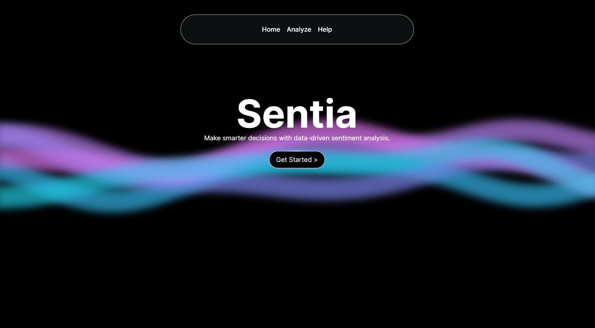

# Sentia - Sentiment Analysis


## Overview

Sentia is a sentiment analysis web application built using Google's Gemini. It allows users to make smarter decisions with data-driven sentiment analysis. The application provides a score from -1 to 1 indicating the sentiment of the input text.



## Features

- **Sentiment Analysis:** Analyze the sentiment of any text input.
- **User-Friendly Interface:** Simple and intuitive UI for ease of use.
- **Responsive Design:** Works seamlessly across various devices.

## Technologies Used

- **Next.js**
- **TypeScript**
- **Tailwind CSS**
- **Google's Gemini**

## Getting Started

### Prerequisites

Make sure you have the following installed:

- Node.js
- npm (Node Package Manager)

### Installation

1. **Clone the repository:**
   ```bash
   git clone https://github.com/yourusername/sentia.git
   cd sentia
   ```

2. **Install dependencies:**
   ```bash
   npm install
   ```

3. **Set up environment variables:**
   Create a `.env` file in the root directory and add your Google Gemini API key:
   ```env
   NEXT_PUBLIC_GEMINI_API_KEY=your_api_key_here
   ```

4. **Run the development server:**
   ```bash
   npm run dev
   ```

   Open [http://localhost:3000](http://localhost:3000) with your browser to see the result.

## Usage

1. **Navigate to the Homepage:**
   Visit the main page of the application where you can start analyzing text.

2. **Input Text:**
   Enter the text you want to analyze in the provided text box.

3. **Analyze:**
   Click on the "Analyze" button to get the sentiment score.

## Project Structure

- `src/`: Contains the source code for the application.
  - `components/`: Reusable components used across the application.
  -   - `public/`: Public assets like images.

## Contributing

Contributions are welcome! Please feel free to submit a pull request or open an issue to discuss changes.

## License

This project is licensed under the MIT License.

## Contact

If you have any questions or feedback, please contact me at asilmehaboob@gmail.com
